# Filecoin-Cosmos: A Modular Redesign - Technical Specification

**Version 3.6**

## 1. Introduction & Core Problem

### 1.1. Challenges of the Current Architecture

The existing Filecoin network operates as a monolithic Layer 1 (L1) blockchain where storage proof verification, smart contract execution via the Filecoin Virtual Machine (FVM), and transaction processing all compete for state machine resources. This architecture, while functional, presents several fundamental challenges that limit its scalability, interoperability, and long-term evolution:

* **High Contribution Barrier for Developers:** By building its entire, highly specialized stack from scratch, the legacy design presents a steep learning curve for new contributors. Unlike platform chains that can attract a wide range of developers to work on different parts of a modular system, the complexity of Filecoin's core protocol makes meaningful contributions difficult. This slows the pace of innovation and makes the ecosystem heavily reliant on a small group of core experts.
    * *This challenge is addressed by leveraging the Cosmos SDK, as detailed in **Section 2: Design Rationale**.*

* **State Machine Contention:** The co-location of storage proof validation and general-purpose computation on the same state machine creates resource contention. A high-volume application on the FVM can lead to fee market spikes, directly impacting the economic viability of submitting time-sensitive storage proofs (`PoSt`). This creates unpredictable operational costs for the core Storage Providers (SPs) and makes the core storage function beholden to the volatility of the application layer.
    * *This challenge is addressed by the modular L1/L2 architecture, as detailed in **Section 3.2: Layer 2 Execution Environment**.*

* **The Incumbent's Dilemma & Innovation Gridlock:** The governance model is intrinsically tied to the existing SPs. While this aligns with a "Proof-of-Useful-Work" ethos, it creates a significant risk of stagnation. Incumbent SPs, who have made massive capital investments in hardware optimized for the current proof system, are rationally disincentivized from approving any protocol upgrade or new proof system that would require new hardware or devalue their existing setup. This creates a political and economic gridlock where the network's evolution can be shackled by the vested interests of its most powerful participants.
    * *This critical challenge is addressed by the Delegated Proof-of-Useful-Work (DPoUW) model, which aligns incentives for innovation, as detailed in **Section 2: Design Rationale** and **Section 3.1: Consensus Mechanism**.*

* **Lack of Native Interoperability:** Cross-chain interactions rely on third-party bridges, which introduce external trust assumptions and security vulnerabilities. There is no native protocol for trust-minimized communication with other sovereign networks. This prevents FIL from being used as native collateral in the burgeoning Cosmos DeFi ecosystem and complicates programmatic interactions between Filecoin and other chains.
    * *This challenge is addressed by natively integrating the Inter-Blockchain Communication (IBC) protocol, as detailed in **Section 4: Native Interoperability via IBC**.*

* **High Barrier to Entry for Providers:** The requirement for a single entity to possess both high-end computational hardware (for `PoRep` sealing) and massive storage capacity creates a significant capital barrier. This favors large, well-capitalized entities, leading to provider centralization and limiting the network's resilience and geographic diversity.
    * *This challenge is addressed by new economic models built on L2s, such as the Sealing-as-a-Service marketplace, as detailed in **Section 3.2.3: L2 Implementation Examples**.*

### 1.2. Proposed Solution: A Modular, Interoperable Protocol

This document specifies a redesign of Filecoin as a modular ecosystem built using the Cosmos SDK. The core principle is the **separation of concerns**, moving the protocol from an integrated system to a composable stack.

The new architecture consists of a specialized L1, the **Filecoin Storage Chain (FSC)**, responsible solely for storage settlement and proof verification. All other functionalities, including smart contracts and specialized markets, are offloaded to Layer 2 (L2) rollups. Native interoperability is achieved via the **Inter-Blockchain Communication (IBC)** protocol. This design aims to enhance scalability, reduce complexity, and improve capital efficiency across the network.

## 2. Design Rationale: Why a Modular, Cosmos-based Approach?

Before detailing the technical architecture, it is crucial to address the strategic rationale for choosing the Cosmos SDK and a modular design. This approach was selected to directly address the limitations of the current monolithic system while preserving Filecoin's core value proposition.

### 2.1. Bridging Concepts: From Filecoin to Cosmos

To help the Filecoin team leverage their existing knowledge, this section maps familiar concepts to their counterparts in the new design.

* **Filecoin Actors → Cosmos SDK Modules:** The built-in actors that manage core protocol logic in legacy Filecoin (e.g., the Storage Market Actor, the Power Actor) are re-implemented as sovereign, composable modules within the Cosmos SDK framework (e.g., `x/dealmarket`, `x/proofs`). This provides a more standardized and maintainable structure.
* **WinningPoSt → CometBFT Proposer Election:** The core mechanism of electing a block producer via the `WinningPoSt` lottery is preserved. However, instead of being part of a bespoke consensus engine, it is now integrated into the `PrepareProposal` step of the CometBFT engine via ABCI++, providing a clear separation between leader election and BFT consensus.
* **The FVM → Application-Specific L2 Rollups:** The general-purpose execution environment provided by the FVM is moved from the L1 into a dedicated L2 rollup. This solves the state machine contention issue while allowing for even greater flexibility, as multiple, specialized execution environments (EVM, CosmWasm, etc.) can exist in parallel.
* **Storage Providers → Delegators:** The role of Storage Providers is elevated. They remain the core workers of the network, but their proven Storage Power now also functions as the "stake" in a Delegated Proof-of-Useful-Work system. They delegate this power to professional Validators, giving them control over the network's consensus and governance.
* **FIL Token → Native IBC Asset:** The FIL token's core functions remain, but its capabilities are massively expanded. Through IBC, it becomes a native, first-class asset across hundreds of other blockchains, enabling trust-minimized use in DeFi and other cross-chain applications without relying on wrapped bridges.

### 2.2. Strategic Rationale

* **Why the Cosmos SDK? - A Framework for Specialization:** The Cosmos SDK is not a blockchain; it is a framework for building them. It provides a battle-tested foundation for networking (CometBFT) and standard modules (like `x/bank` and `x/gov`), allowing development to focus on what makes Filecoin unique. By building the FSC with the SDK, we are not adopting a generic Proof-of-Stake (PoS) system. Instead, we are leveraging a shared, open-source foundation to build a highly specialized L1 whose consensus is driven by Filecoin's own Proof-of-Useful-Work, as detailed in Section 3. This directly addresses the **High Contribution Barrier for Developers** by lowering the development overhead associated with maintaining a completely bespoke L1 stack.

* **Why IBC? - True, Trust-Minimized Interoperability:** The Inter-Blockchain Communication (IBC) protocol is fundamentally more secure than the federated or multi-signature bridges common in other ecosystems. IBC's security model relies on on-chain light clients, meaning the security of a cross-chain transaction is guaranteed by the consensus mechanisms of the two participating chains, not by a small, trusted set of external validators. This allows FIL to become a native, first-class asset across hundreds of chains, solving the **Lack of Native Interoperability** and unlocking its full potential as high-quality collateral and a universal medium of exchange for data services.

* **Why a Modular L1/L2 Architecture? - A Game-Theoretic Solution to the Incumbent's Dilemma:** A critical challenge in any decentralized protocol with established economic actors is the "incumbent's dilemma": why would existing participants vote for an innovation that could devalue their current investments? This design solves this problem by creating a system where innovation is a source of new revenue, not a threat.
    * **The Problem with Direct Governance:** If SPs voted directly on all technical upgrades, they would be rationally incentivized to reject any new proof system that requires new hardware, thus stifling innovation. Their primary income is from block rewards tied to their existing hardware, so any change that threatens that hardware is a direct threat to their business.
    * **The DPoUW Solution:** The proposed **Delegated Proof-of-Useful-Work (DPoUW)** model (Section 3.1) creates a professional class of **Validators** whose primary incentive is to maximize their revenue from **transaction fees**.
    * **Market-Driven Innovation:** This creates a powerful, market-driven pull for innovation. New proof systems (like `poa-v1` for hot storage) enable new types of L2 applications (e.g., gaming, AI data markets), which generate a massive new stream of transaction fees. Validators are therefore **strongly economically incentivized to support and validate proofs from these new systems** to capture this new fee revenue.
    * **Aligning All Participants:** This creates a positive-sum game. An incumbent SP, even if they don't want to invest in new hardware themselves, is now incentivized to delegate their Storage Power to the most forward-thinking and profitable Validators—those who support the most diverse set of proof systems. By doing so, they can earn a share of the new fee revenue through their validator's commission. This elegantly decouples the decision to innovate from the SPs' direct hardware interests and aligns all participants towards expanding the network's total addressable market.

* **Why Mention Rollup Frameworks like the OP Stack? - Demonstrating Maturity:** The reference to frameworks like the OP Stack (Section 3.2.3) is not a proposal to adopt Ethereum's specific technology stack. It serves as a concrete example to demonstrate that the application-specific L2 model is a mature, well-established pattern in the real world. It shows that a clear, open-source path exists for teams to build and deploy these L2s, significantly de-risking the development of the ecosystem.

## 3. System Architecture

The redesigned architecture is composed of two primary layers: a base settlement layer (L1) and a flexible execution layer (L2).

*Figure 1: High-level modular architecture of the redesigned Filecoin ecosystem.*

### 3.1. Layer 1: The Filecoin Storage Chain (FSC)

The FSC is a purpose-built blockchain using the Cosmos SDK, optimized for processing storage-related state transitions with maximum security and efficiency.

* **Technology Stack:** Cosmos SDK, CometBFT Consensus Engine, ABCI++.
* **Custom Cosmos Modules:**
    * **`x/proofs`:** The core module for managing proof systems and sector state. Its primary responsibility is to track the `SectorInfo` for every active sector and verify submitted proofs against the logic in the `x/proofs` module's registry.
    * **`x/dealmarket`:** Manages the on-chain storage deal marketplace, acting as a trustless arbiter for storage agreements.
* **Consensus Mechanism: Delegated Proof-of-Useful-Work (DPoUW) via a Virtual Staking Module**
    * **Core Principle:** This design replaces capital-based staking with a system where consensus power is derived from proven, useful work. It achieves this through an elegant hybrid approach that combines a lightweight custom module with modified versions of the standard Cosmos `x/staking` and `x/gov` modules, leveraging their battle-tested security.
    * **Implementation (`x/powerstake`):**
        1.  A new, lightweight custom module, **`x/powerstake`**, is created. Its sole responsibility is to maintain an on-chain mapping of each Storage Provider's (SP) address to their current, validated Storage Power. This is stored as a "power balance" in the module's state.
        2.  At the end of every block, this module's `EndBlocker` queries the `x/proofs` module to get the latest Storage Power for every active SP and updates its internal state. This is a single, efficient state write per provider, avoiding the state bloat of minting/burning tokens.
        3.  The standard Cosmos `x/staking` and `x/gov` modules are then forked with a minimal change: instead of querying the `x/bank` module for a user's balance of a staking token, they are redirected to query the `x/powerstake` module for an SP's "power balance."
    * **Delegation and Validation:** SPs can delegate their "power balance" to a professional set of Validators using the modified `x/staking` module. This delegation can be fractional, allowing an SP to support multiple validators. The voting power of these Validators in the CometBFT consensus is determined by the total Storage Power delegated to them. This creates a robust DPoUW system that is secure, modular, and minimizes custom code.

*Figure 2: The Virtual Staking Module Architecture.*

### 3.2. Layer 2: The Execution Environment

All general-purpose computation is moved to Layer 2 (L2) rollups that use the FSC for settlement and permanent data archival. This architectural separation is critical: it isolates the high-throughput, application-specific execution environment of an L2 from the high-security, low-throughput settlement environment of the L1, allowing both to be optimized independently.

#### 3.2.1. L2 Rollup Architecture: Core Components

An application-specific L2 in this ecosystem consists of several interacting components, both off-chain and on-chain, working in concert.

* **Sequencer (Off-chain Operator):** The Sequencer is the primary operator of the L2. It is responsible for:
    1.  **Transaction Ingestion:** Accepting transactions from users via an RPC endpoint.
    2.  **Transaction Ordering:** Establishing a definitive sequence for these transactions to prevent MEV and ensure deterministic state transitions.
    3.  **Block Production:** Grouping ordered transactions into L2 blocks.
    4.  **State Computation:** Executing the L2 blocks to compute the resulting L2 state root.
    5.  **L1 Communication:** Submitting the L2's state commitments and proof of data archival to the FSC L1.

* **Execution Nodes (Off-chain Verifiers):** These nodes are independent participants who ensure the Sequencer's integrity. They download the raw L2 transaction data from the FSC (once archived) and independently re-execute the transactions to verify the state root submitted by the Sequencer.

* **Settlement Contract (On-chain L1 Anchor):** This is a smart contract deployed on the FSC that serves as the trust-minimized bridge and source of truth for a specific L2. Its logic is tailored to the rollup type (Optimistic or ZK).

#### 3.2.2. The Proof-of-Archival Mechanism

A key innovation of this design is the **Proof-of-Archival** link, a cryptoeconomic requirement enforced by the Settlement Contract that guarantees the permanent archival of L2 history. The contract will only accept a new state root from the L2's Sequencer if the settlement transaction also includes a valid `DealID` from the `x/dealmarket` module, proving the L2's transaction data has been committed to storage.

#### 3.2.3. L2 Implementation Examples

The L2s in this design are **application-specific chains**, each built for a specific purpose. Teams would leverage open-source rollup frameworks (like the OP Stack) to accelerate development, modifying the data submission component to implement the Proof-of-Archival workflow. Below are concrete examples.

##### Example A: "dSocial" - A General-Purpose Application L2

To illustrate the general workflow, consider **"dSocial,"** a decentralized social media application built as an EVM-compatible L2 on the FSC. A user action, like making a post, flows through the entire stack as detailed below.

*Figure 3: A flowchart illustrating the logical data flow for L2 settlement and archival.*

*Figure 4: A sequence diagram illustrating the chronological order of operations for an L2 transaction.*

##### Example B: The Decoupled Retrieval Market L2

This specialized L2 is designed to solve the problem of slow data retrieval by creating a formal, incentivized market for fast access.

* **Role:** A network of **Retrieval Providers** who cache popular, unsealed data and serve it to users with low latency.
* **Incentives & Slashing:** This market is managed by the L2's smart contracts. Retrieval Providers stake FIL as a bond to guarantee a certain level of service. A client requesting data first locks a small payment in an escrow channel. Upon successful retrieval, the payment is released. If the provider fails to serve the data within a specified time, the client can submit the failed request (signed by the provider's hot-key) to the L2 smart contract, which triggers a slashing of the provider's bond.

*Figure 5: Decoupled Retrieval Market Workflow.*

##### Example C: The Sealing-as-a-Service (SaaS) L2

This specialized L2 is designed to lower the high barrier to entry for new storage providers by creating a marketplace for the computationally expensive sealing process.

* **Concept:** An L2 marketplace connecting Storage Providers (who need data sealed) with specialized "Sealers" (who have the powerful hardware).
* **Workflow & Dispute Resolution:**
    1.  A Storage Provider locks FIL into the SaaS smart contract, specifying the data CID to be sealed.
    2.  A Sealer accepts the task, also locking a bond.
    3.  The Sealer performs the sealing and submits the resulting `CommR` to the contract.
    4.  The Storage Provider has a window to challenge. A challenge would require the Sealer to generate a zk-SNARK proving the `CommR` was correctly derived from the original data CID. Failure to provide this proof results in the Sealer's bond being slashed. This trust-minimized process ensures accountability.

```mermaid
graph TD
    A[Storage Provider] -- "1\. Creates Task (Locks FIL)" --> B{SaaS L2 Contract}
    C[Sealer] -- "2\. Accepts Task (Locks Bond)" --> B
    B -- "3\. Assigns Task" --> C
    C -- "4\. Performs Sealing" --> D((Original Data))
    C -- "5\. Submits CommR" --> B
    B -- "6\. Notifies SP" --> A
    A -- "7\. Challenge Period" --> E{Challenge CommR?}
    E -- "No" --> G[Happy Path: Release Payment & Forward CommR]
    E -- "Yes" --> F[Dispute: Request ZKP from Sealer]
    F --> H{ZKP Valid?}
    H -- "Yes" --> G
    H -- "No" --> I[Slashing Path: Slash Sealer & Refund SP]

    style B fill:#cde4ff,stroke:#6a8ebf,stroke-width:2px
```

*Figure 6: Sealing-as-a-Service Workflow.*

## 4. Native Interoperability via IBC

The FSC will implement the Inter-Blockchain Communication (IBC) protocol, enabling native, trust-minimized cross-chain interactions.

* **FIL as Native DeFi Collateral:** Using the standard ICS-20 token transfer protocol, FIL can be transferred to any IBC-enabled chain. This is not wrapped FIL; it is the native asset, with its security managed by the two participating chains' light clients. This dramatically increases FIL's utility and capital efficiency.
* **Cross-Chain Storage Deals via Interchain Accounts (ICA):** A DAO on a controller chain (e.g., Juno) can use ICA to create and control an account on the FSC. The DAO's smart contract can then construct and send a `MsgInitiateDeal` transaction, which is executed by its account on the FSC. This allows for fully programmatic, cross-chain control over storage deals without custom application logic.
* **Cross-Chain Queries (ICQ):** The design can be further enhanced with Interchain Queries. A DeFi protocol on another chain could use ICQ to directly query the FSC's `x/proofs` module to verify a storage provider's real-time power and collateral. This would allow for the creation of sophisticated, under-collateralized lending products for SPs, where the loan terms are dynamically adjusted based on verifiable, on-chain performance data.

## 5. Pluggable Proofs & Provider Evolution

### 5.1. The Pluggable Proofs Framework

The `x/proofs` module on the FSC L1 will be designed as an extensible registry.

*Figure 7: Workflow for the Pluggable Proofs system.*

* **Mechanism:** New proof systems can be added to the network via a governance vote. A successful proposal will register the new proof's `proof_id`, its verification algorithm (as a Wasm binary), and its specific slashing parameters. This allows the network to adapt to new cryptographic breakthroughs without disruptive hard forks.
* **Marketplace of Proofs:** When a client initiates a deal, they specify which `proof_id` they require, creating a market for different levels of security and performance.

### 5.2. Implications for Existing Storage Providers

* **No Forced Upgrades:** The original PoRep/PoSt system will be registered as the "genesis" proof system (`proof_id: "porep-v1"`). All existing hardware and sealed sectors will continue to be fully supported.
* **Opt-in Opportunities:** Adopting a new proof system is an optional business decision, not a mandate. It allows providers to diversify their services.

### 5.3. Example: "Proof-of-Access" for Hot Storage

* **Name:** Proof-of-Access (`proof_id: "poa-v1"`)
* **Goal:** To provide a lower-security but extremely fast proof for data that needs to be retrieved frequently.
* **Mechanism:** It would feature a much faster sealing process (or none at all) and more frequent, low-latency challenges that require instant access to the data.
* **Hardware:** Optimized for fast SSDs, enabling a new class of "hot storage" providers.

## 6. Phased Migration Strategy & Detailed Roadmap

A full migration is a monumental task. A phased rollout is essential to de-risk the process, build confidence, and ensure a seamless transition for the entire community. While the development of the new FSC (Phase 2) is not technically dependent on Phase 1, this phased approach is a strategic imperative for managing project risk and building community consensus.

### 6.1. Token & State Migration Mechanisms

The migration requires two distinct but related processes: migrating the liquid FIL token supply and migrating the state of existing storage providers.

#### 6.1.1. Coin Migration via a Lock-and-Mint Bridge

The transfer of FIL tokens between the legacy chain and the new FSC will be handled by a standard two-way token bridge.

* **Mechanism:**
    1.  **Lock on Legacy:** A user sends FIL to a "Bridge Address" on the legacy chain, where it is verifiably locked.
    2.  **Verification:** Off-chain relayers submit proof of this lock transaction to a bridge contract on the new FSC. The FSC's on-chain light client of the legacy chain verifies this proof.
    3.  **Mint on FSC:** Upon verification, the bridge contract on the FSC mints an equivalent amount of native FIL on the new chain to the user's address.
* **Two-Way Peg:** The process works in reverse (burn on FSC, unlock on legacy) to ensure the total circulating supply of FIL remains constant across both networks during the transition.

*Figure 8: The FIL Coin Migration Workflow.*

#### 6.1.2. Provider State Migration

This mechanism allows existing SPs to migrate their proven storage capacity without re-sealing any data. It is a **state migration**, not a data migration.

* **Mechanism:**
    1.  **Initiation:** An SP initiates the migration for a batch of their sectors. This can be done incrementally, allowing for a gradual and low-risk transition.
    2.  **Merkle Proof Generation:** The SP generates a cryptographic Merkle proof from the legacy chain's state, proving they are the legitimate owner of the specified sector commitments (`CommR`).
    3.  **On-Chain Verification:** The SP submits this proof to the State Migration Bridge contract on the new FSC. The bridge contract verifies the proof against the legacy chain's state root, which it tracks via its light client.
    4.  **State Registration:** Upon successful verification, the bridge instructs the `x/proofs` module to register the sectors under the SP's address on the new chain. The SP can then immediately begin submitting PoSt proofs for these migrated sectors on the FSC.

### 6.2. The Migration Roadmap

* **Phase 1: Bridge & Connect (Strategic Initiative)**
    * **Objective:** To demonstrate immediate value from interoperability and begin social/developer bootstrapping.
    * **Key Deliverables:**
        1.  **IBC Light Client for Filecoin:** Develop and deploy a light client for the legacy Filecoin chain that can run within a Cosmos SDK module.
        2.  **Bridge Deployment:** Launch a trust-minimized bridge connecting the legacy chain to a major Cosmos hub.
        3.  **Liquidity Seeding:** Work with ecosystem partners to create a FIL/ATOM liquidity pool on a major Cosmos DEX like Osmosis.
        4.  **Developer Outreach:** Launch a campaign to educate Cosmos developers on how to interact with FIL and the legacy Filecoin network via the new bridge.

* **Phase 2: Build & Test (New Network)**
    * **Objective:** To build and rigorously test the new Filecoin Storage Chain (FSC) and its initial L2 ecosystem.
    * **Key Deliverables:**
        1.  **FSC Core Module Completion:** Finalize the development of the `x/proofs`, `x/dealmarket`, and `x/powerstake` modules.
        2.  **Internal Testnet:** Launch a private testnet for core developers and partners to validate the L1 functionality.
        3.  **L2 Developer Toolkit Release:** Release a developer toolkit and reference implementation for building rollups on the FSC. This will consist of a forked and modified version of a popular open-source framework (e.g., the OP Stack), including the necessary components to implement the Proof-of-Archival mechanism.
        4.  **Incentivized Public Testnet:** Launch a public testnet with significant token rewards for all participants.

* **Phase 3: Migrate & Evolve (The Transition)**
    * **Objective:** To orchestrate a smooth, secure, and economically attractive migration from the legacy chain to the new modular ecosystem.
    * **Key Deliverables:**
        1.  **Migration Bridges Mainnet Launch:** Deploy the token and state migration bridges.
        2.  **FSC Mainnet Genesis:** Launch the Filecoin Storage Chain mainnet.
        3.  **Launch of Migration Incentives:** Activate economic incentives to encourage early adoption.
        4.  **Legacy Chain "Maintenance Mode":** After a migration window, enter a maintenance mode where new deals are disabled.
        5.  **Full Sunset:** After all deals on the legacy chain have expired or been migrated, the chain can be officially sunsetted.

## 7. Governance

The FSC will be governed by its network participants through a system that maintains the core "Proof-of-Useful-Work" ethos.

*Figure 9: The Delegated Proof-of-Useful-Work Governance Model.*

* **Voting Power Calculation:** The FSC **does not** use a standard capital-based Proof-of-Stake model for governance. The `x/gov` module will be modified to calculate voting power based on a Validator's total **Delegated Storage Power**, not their liquid FIL holdings. This ensures that influence over the protocol's future is directly proportional to the network's useful work. This maintains the core security principle of the consensus mechanism and prevents governance from being captured by pure capital holders who are not actively providing the network's core service.

* **On-Chain Governance:** The chain will use the standard Cosmos `x/gov` module for the proposal and voting framework. Any participant can submit a proposal, which then goes to a vote by the active Validator set.

* **The Role of the Social Layer:** This design intentionally simplifies the on-chain governance mechanism, placing a greater emphasis on the off-chain social layer. Without formal councils, the responsibility falls to the community—including research groups, core developers, and large storage providers—to publicly debate, analyze, and advocate for or against proposals on forums, community calls, and social media. Validators are then expected to make informed decisions based on this public discourse and their own technical due diligence, knowing that their delegators (the SPs) will hold them accountable for their voting record. This creates a more dynamic and fluid governance process, but one that requires a highly engaged and sophisticated community.

## 8. Conclusion

This redesign represents a strategic evolution for Filecoin. By embracing modularity, interoperability, and a flexible, multi-proof architecture with the Cosmos SDK, Filecoin can solve its most pressing challenges and fulfill its ultimate potential. It moves from being an isolated, monolithic network to becoming the foundational, composable, and permanent **archival layer for the entire decentralized web.**
